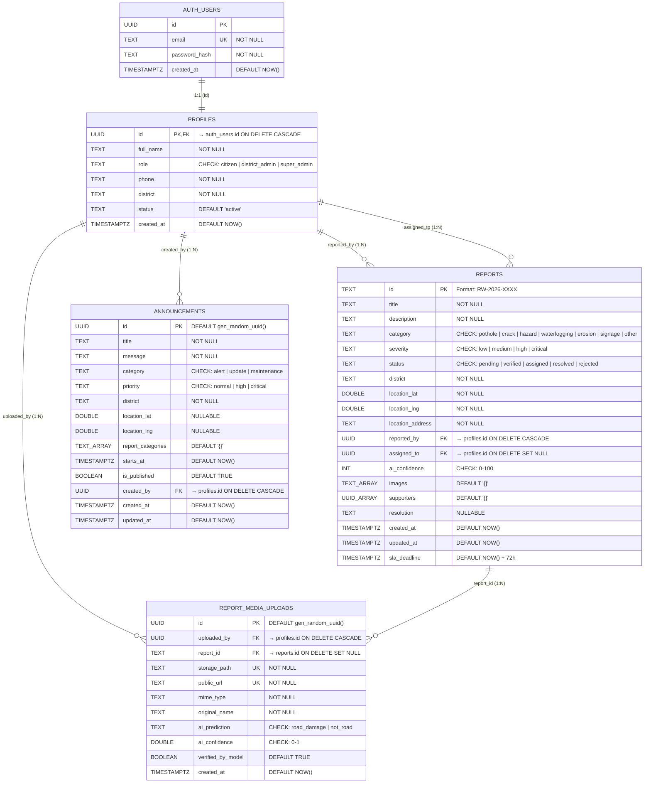
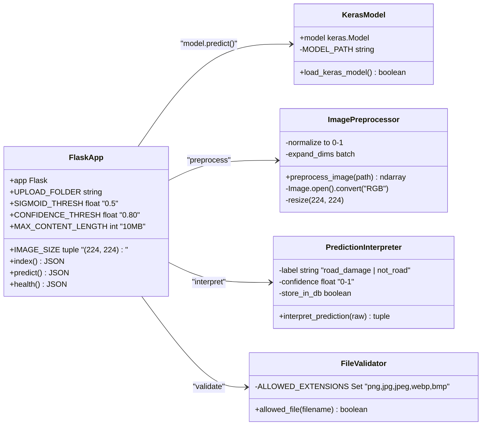
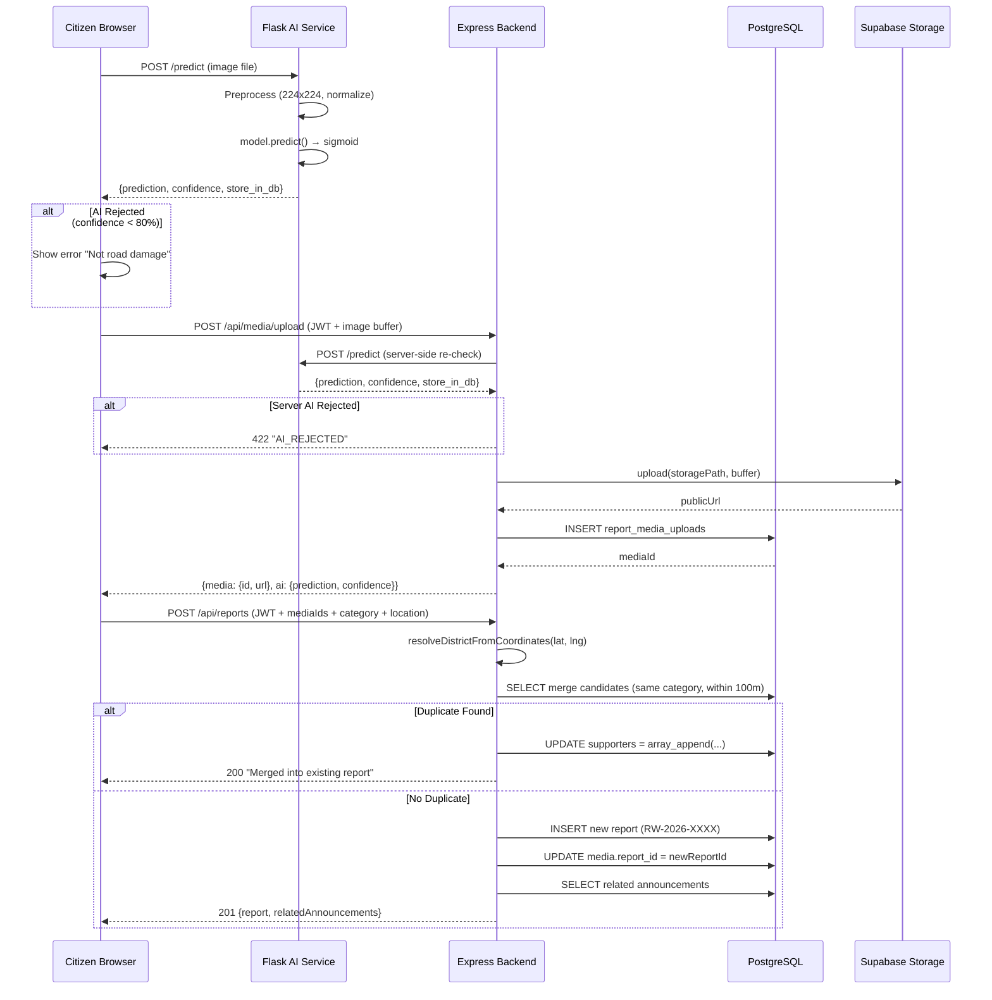

# 🚦 RoadWatch — ER Diagram & Class Diagram

---

## 1. Entity-Relationship (ER) Diagram



### Relationship Summary

| Relationship | Cardinality | Description |
|---|---|---|
| `auth_users` ↔ `profiles` | **1 : 1** | Every auth record has exactly one profile (shared PK) |
| `profiles` → `reports` (reported_by) | **1 : N** | A citizen can file many reports |
| `profiles` → `reports` (assigned_to) | **1 : N** | An admin can be assigned many reports |
| `profiles` → `report_media_uploads` | **1 : N** | A user can upload many images |
| `reports` → `report_media_uploads` | **1 : N** | A report can have many media attachments |
| `profiles` → `announcements` | **1 : N** | An admin can create many announcements |
| `reports.supporters[]` → `profiles` | **M : N** (via array) | Many citizens can support many reports |

> [!NOTE]
> The `supporters UUID[]` column implements a **logical M:N** relationship without a junction table. This is a deliberate trade-off — simpler writes via `array_append` at the cost of losing FK constraints on individual supporter entries.

---

## 2. Class Diagram (Backend Architecture)

```mermaid
classDiagram
    direction TB

    class ExpressServer {
        +express app
        +bootstrapDatabase()
        +startServer()
        -cors()
        -express.json()
        -errorHandler()
    }

    class AuthController {
        +signupCitizen(req, res, next)
        +login(req, res, next)
        +me(req, res, next)
        -issueToken(user) JWT
        -roleLandingPath Map
    }

    class ReportsController {
        +listReports(req, res, next)
        +createReport(req, res, next)
        +updateReportStatus(req, res, next)
        +supportReport(req, res, next)
        -mapReportRow(row) Report
        -calculateDistanceKm(lat1, lon1, lat2, lon2) number
    }

    class MediaController {
        +uploadReportMedia(req, res, next)
        -ensureBucket(supabaseAdmin)
        -sanitizeFileName(name) string
        -allowedMimeTypes Set
    }

    class AdminController {
        +listDistrictAdmins(req, res, next)
        +createDistrictAdmin(req, res, next)
        +updateDistrictAdmin(req, res, next)
        +deleteDistrictAdmin(req, res, next)
        -validateAdminPayload(payload, options) string[]
    }

    class AnalyticsController {
        +getAnalytics(req, res, next)
    }

    class AnnouncementsController {
        +listAnnouncements(req, res, next)
        +createAnnouncement(req, res, next)
        +deleteAnnouncement(req, res, next)
        +getRelatedAnnouncements(req, res, next)
        -mapAnnouncementRow(row) Announcement
        -resolveRequestDistrict(params) string
    }

    class AuthMiddleware {
        +authenticate(req, res, next)
        +authorizeRoles(...roles) middleware
    }

    class ErrorHandler {
        +errorHandler(err, req, res, next)
        -transientDbCodes Set
    }

    class DatabasePool {
        +pool pg.Pool
        +connectionString string
        +max 10
        +ssl rejectUnauthorized false
    }

    class SupabaseAdmin {
        +getSupabaseAdmin() Client
        -cachedClient Client
        -isConfiguredValue(value) boolean
    }

    class AiFilterUtil {
        +classifyImage(imageBuffer, originalName) AiFilterResult
        -guessMime(filename) string
    }

    class DistrictResolver {
        +resolveDistrictFromCoordinates(lat, lng) string
        +isSupportedDistrict(district) boolean
        +SUPPORTED_DISTRICTS string[]
        +DISTRICT_BOUNDARIES Geofence[]
        -isPointInPolygon(lat, lng, polygon) boolean
        -DISTRICT_GEOFENCES Geofence[]
    }

    class InitDb {
        +initializeDatabase()
    }

    class SeedSuperAdmin {
        +seedSuperAdmin()
    }

    class SeedCoreData {
        +seedCoreData()
        -ensureUser(client, user, role) UserRecord
    }

    ExpressServer --> AuthController : "/api/auth"
    ExpressServer --> ReportsController : "/api/reports"
    ExpressServer --> MediaController : "/api/media"
    ExpressServer --> AdminController : "/api/admin"
    ExpressServer --> AnalyticsController : "/api/analytics"
    ExpressServer --> AnnouncementsController : "/api/announcements"
    ExpressServer --> AuthMiddleware : "middleware"
    ExpressServer --> ErrorHandler : "middleware"
    ExpressServer --> InitDb : "bootstrap"
    ExpressServer --> SeedSuperAdmin : "bootstrap"
    ExpressServer --> SeedCoreData : "bootstrap"

    AuthController --> DatabasePool : "queries"
    ReportsController --> DatabasePool : "queries"
    ReportsController --> DistrictResolver : "geofence"
    MediaController --> DatabasePool : "queries"
    MediaController --> SupabaseAdmin : "storage"
    MediaController --> AiFilterUtil : "classify"
    AdminController --> DatabasePool : "queries"
    AnalyticsController --> DatabasePool : "queries"
    AnalyticsController --> DistrictResolver : "district list"
    AnnouncementsController --> DatabasePool : "queries"
    AnnouncementsController --> DistrictResolver : "resolve"
    InitDb --> DatabasePool : "schema"
    SeedSuperAdmin --> DatabasePool : "seed"
    SeedCoreData --> DatabasePool : "seed"
```



---

## 3. Class Diagram (Frontend Architecture)

```mermaid
classDiagram
    direction TB

    class App {
        +ProtectedRoute component
        +bootstrap() void
        -fetchCurrentUser()
        -fetchReports()
        -fetchAnnouncements()
        -fetchAnalytics()
        -fetchDistrictAdmins()
    }

    class ZustandStore {
        +theme string
        +user UserObject
        +token string
        +isAuthenticated boolean
        +userRole string
        +reports Report[]
        +announcements Announcement[]
        +districtAdmins Admin[]
        +districts District[]
        +analyticsSummary object
        +login(email, password) Route
        +logout() void
        +signupCitizen(payload) void
        +fetchCurrentUser() User
        +createReport(payload) ReportResult
        +uploadReportMedia(file) MediaResult
        +supportReport(id) Report
        +updateReportStatus(id, status) Report
        +createAnnouncement(payload) Announcement
        +deleteAnnouncement(id) void
        +fetchReports(query) Report[]
        +fetchAnnouncements(query) Announcement[]
        +fetchAnalytics(query) AnalyticsData
        +fetchDistrictAdmins() Admin[]
        +checkSimilarReports(params) Report[]
        +getFilteredReports() Report[]
        +getStats() StatsObject
        +toggleTheme() void
    }

    class LandingPage {
        +Hero section
        +Features section
        +CTA section
    }

    class LoginPage {
        +mode string "login | signup"
        +handleLogin(e) void
        +handleCitizenSignup(e) void
    }

    class ReportPage {
        +step number "1=Camera | 2=Details | 3=Success"
        +image string
        +aiData object
        +location LatLng
        +formData FormState
        +similarReports Report[]
        +relatedAnnouncements Announcement[]
        +processSelectedImage(file) boolean
        +captureFromLiveCamera() void
        +handleSubmit() void
        +handleSupportReport(id) void
        -analyzeRoadLikelihood(file) AiResult
        -reverseGeocode(lat, lng) string
        -fetchCurrentLocation() void
        -startCameraStream() void
        -stopCameraStream() void
    }

    class DashboardPage {
        +stats StatsObject
        +recentReports Report[]
    }

    class AdminPage {
        +reports Report[]
        +selectedReport Report
        +incidentFeed Report[]
        +mapView Leaflet
        +handleVerify(id) void
        +handleResolve(id, resolution) void
    }

    class SuperAdminPage {
        +districtAdmins Admin[]
        +districts District[]
        +createDistrictAdmin(payload) void
        +updateDistrictAdmin(id, payload) void
        +deleteDistrictAdmin(id) void
    }

    class AnalyticsPage {
        +summary AnalyticsStats
        +monthlyTrend ChartData[]
        +issueCategories CategoryData[]
        +districtPerformance DistrictData[]
    }

    class AnnouncementsPage {
        +announcements Announcement[]
        +filter string
    }

    class AdminAnnouncementsPage {
        +announcements Announcement[]
        +createAnnouncement(payload) void
        +deleteAnnouncement(id) void
    }

    class HeaderComponent {
        +navigation links
        +userProfile display
        +themeToggle button
    }

    class MapViewComponent {
        +center LatLng
        +zoom number
        +reports Report[]
        +interactive boolean
    }

    class ReportTrackerPage {
        +reportId string
        +report Report
        +statusTimeline Step[]
    }

    App --> ZustandStore : "state"
    App --> LandingPage : "/"
    App --> LoginPage : "/login"
    App --> ReportPage : "/report"
    App --> DashboardPage : "/dashboard"
    App --> AdminPage : "/admin/district"
    App --> SuperAdminPage : "/admin/super"
    App --> AnalyticsPage : "/analytics"
    App --> AnnouncementsPage : "/announcements"
    App --> AdminAnnouncementsPage : "/admin/announcements"
    App --> ReportTrackerPage : "/report/:id"
    App --> HeaderComponent : "global"

    LoginPage --> ZustandStore : "login/signup"
    ReportPage --> ZustandStore : "createReport"
    ReportPage --> MapViewComponent : "location preview"
    AdminPage --> ZustandStore : "updateStatus"
    AdminPage --> MapViewComponent : "incident map"
    SuperAdminPage --> ZustandStore : "CRUD admins"
    AnalyticsPage --> ZustandStore : "fetchAnalytics"
    AnnouncementsPage --> ZustandStore : "fetchAnnouncements"
    DashboardPage --> ZustandStore : "getStats"
```

---

## 4. AI Microservice Class Diagram



---

## 5. Data Flow Sequence (Report Creation)


